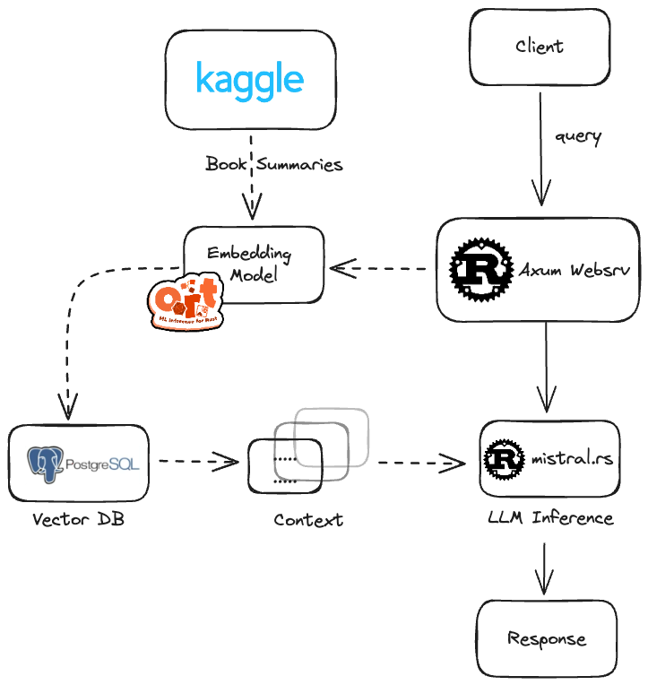

# Rusty RAG - LLM-powered Book Recommendation
This project implements a simple semantic search and RAG use-case with rust, pgvector and ollama and serves a frontend and rest-api to recommend books based on the [CMU Book Summary Dataset](https://www.kaggle.com/datasets/ymaricar/cmu-book-summary-dataset/data).



# Setup

## Start database and ollama instance
First run:
```bash
docker-compose up
```
to start the postgres database and the ollama instance.

## Generate book summary embeddings


Then download the dataset from [Kaggle](https://www.kaggle.com/datasets/ymaricar/cmu-book-summary-dataset?resource=download&select=booksummaries.txt) and start the embedding generation:

```
cargo run --release --bin embedding-generator -- --num-summaries 16384 --num-chunks 2048 --summaries_file ./booksummaries.txt
```

## Run the web application
```
cargo run --release --bin rustyrag
```
